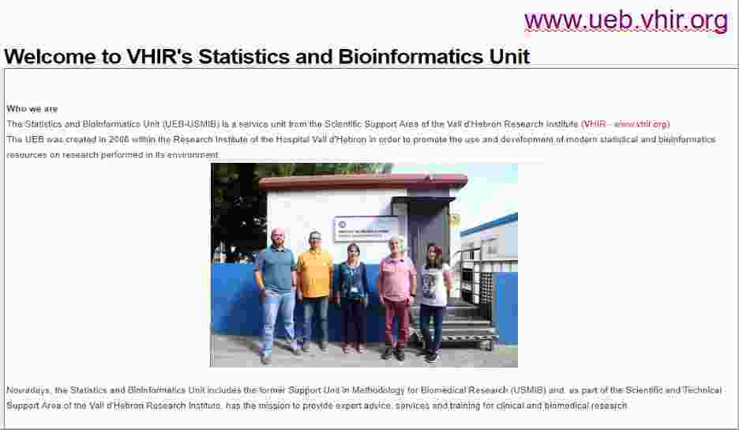
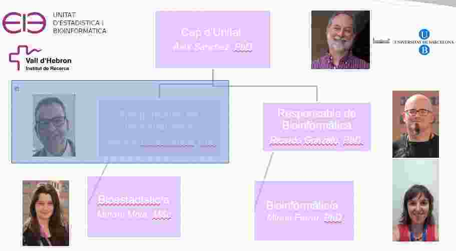
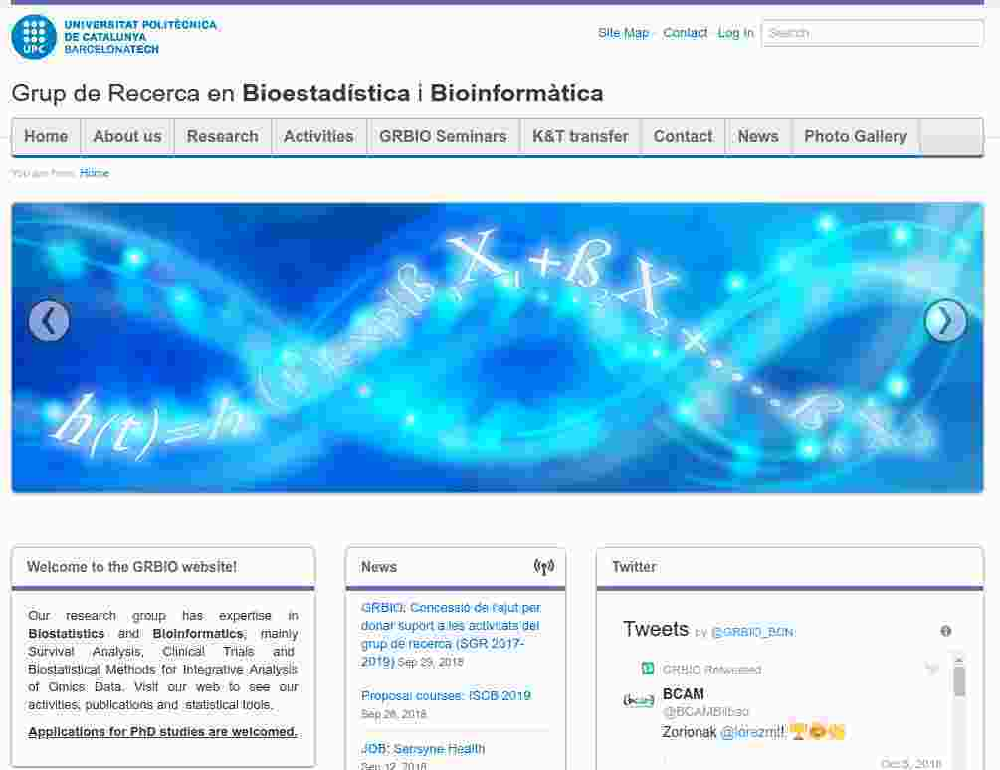

```{r setLicense, child = 'license.Rmd'}
```

Outline
===========================================
- Who are we ("we"=teachers & students)
    + UEB
    + GRBio
- Why are we here (Why learn R?) 
    + Objectives and competences
    + Course contents
- How will we proceed: Methodology
- A first contact with R & Rstudio
- HW Data Science approach to using R
- References & Resources

Who are we (1): The Statistics and Bioinformatics Unit
=======================================
<div align="center"> 
  
</div>

Who are we (2): Teachers
=======================================
<div align="center"> 
  
</div>

Who are we (3): The GRBio Research group
=======================================
<div align="center"> 
  
</div>

Why learn R
==============

- Most people in most jobs have to _manage_ information in their every day work.
- "Managing" may mean different things such as: 
    + _retrieving_
    + _manipulating_
    + _visualizing_
    + _analyzing_
    + _reporting_
    
<div align="center"> 
  
</div>
    
- R is a powerful tool that can be used to facilitate, improve or automate tasks such as those described above.

Your turn
=================

- Provide examples of informations you may wish to manage
- Describe briefly 
    + what this information is about
    + how it is stored
    + what you may wish to do with it
        - Transformations
        - Computations
        - Reports

How we will work
===================

- Mastering R requires as many other disciplines
    (i) Time 
    (ii) Study, and 
    (iii) Practice.
    
- Our lectures will have the following structure (all but the first)

    + 1st part: Discuss the work you have done during the week
    + 2nd part: We introduce a few new ideas
    + 3rd part: Practice exercises and start working on the case study suggested/your data.
    

[What is R?](https://www.r-project.org/about.html)
============

- R is a _language and environment_ for statistical computing and graphics.

- R provides a wide variety of statistical and graphical techniques, and is highly extensible.

- One of R’s strengths is the ease with which well-designed publication-quality plots can be produced, R is available as Free Software from the CRAN site [CRAN](https://www.r-project.org) site, under the terms of the Free Software Foundation’s GNU General Public License in source code form. 

- It compiles and runs on a wide variety of UNIX platforms and similar systems Windows and MacOS.

R PRO's (why you are here!)
============================

- The system is 
    + free (as in _free beer_)
    + It's platform independent
    + It is constantly improving (2 new versions/year)
    
- It is a statistical tool
    + Implements almost every statistical method that exists
    + Great graphics (Examples)
    + Simple reporting tools
    + Also state-of-the-art in Bioinformatics through the [Bioconductor Project](http://bioconductor.org).

- Programming language
    + Easy to automate repetitive tasks (Example_1.1)
    + Possibility to create user friendly web interfaces  with a moderate effort. (Examples)
    
R CON's
=====================

- R is mainly used issuing commands from a console
    + less user friendly that almost any other statistical tool you may know.
    
- Constantly having new versions may affect our projects

- Not necessarily the best language nor suitable for every existing task
