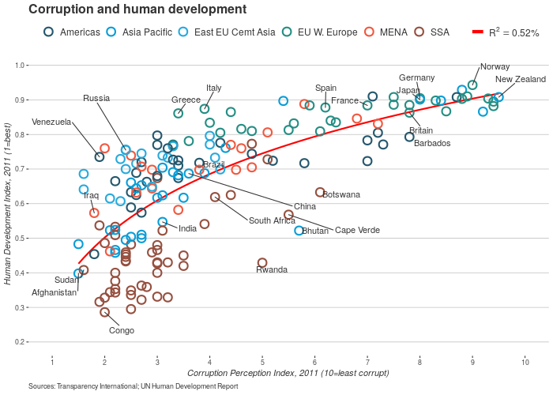

# Introduction: The goal of the exercise is to produce a plot which is as similar as possible to the plot below using the data from the file "EconomistData.sav"



# Steps to follow

## Load the data

```{r}
library(readr)
dat <- read_csv("dataSets/EconomistData.csv")
```
```{r}
library(ggplot2)
library(ggrepel)
pointsToLabel <- c("Russia", "Venezuela", "Iraq", "Myanmar", "Sudan",
                   "Afghanistan", "Congo", "Greece", "Argentina", "Brazil",
                   "India", "Italy", "China", "South Africa", "Spane",
                   "Botswana", "Cape Verde", "Bhutan", "Rwanda", "France",
                   "United States", "Germany", "Britain", "Barbados", "Norway","Japan","New Zealand", "Singapore")

mR2 <- summary(lm(HDI ~ CPI + log(CPI), data = dat))$r.squared
mR2 <- paste0(format(mR2, digits = 2), "%")

p <- ggplot(dat,
            mapping = aes(x = CPI, y = HDI)) +
  geom_smooth(mapping = aes(linetype = "r2"),
              method = "lm",
              formula = y ~ x + log(x), se = FALSE,
              color = "red") +
  geom_point(mapping = aes(color = Region),
             shape = 1,
             size = 4,
             stroke = 1.5) +
  geom_text_repel(mapping = aes(label = Country, alpha = labels),
                  color = "gray20",
                  data = transform(dat,
                                   labels = Country %in% pointsToLabel) +
  scale_x_continuous(name = "Corruption Perception Index, 2011 (10=least corrupt)",
                     limits = c(1.0, 10.0),
                     breaks = 1:10) +
  scale_y_continuous(name = "Human Development Index, 2011 (1=best)",
                     limits = c(0.2, 1.0),
                     breaks = seq(0.2, 1.0, by = 0.1)) +
  scale_color_manual(name = "",
                     values = c("#24576D",
                                "#099DD7",
                                "#28AADC",
                                "#248E84",
                                "#F2583F",
                                "#96503F"),
                     guide = guide_legend(nrow = 1, order=1)) +
  scale_alpha_discrete(range = c(0, 1),
                       guide = FALSE) +
  scale_linetype(name = "",
                 breaks = "r2",
                 labels = list(bquote(R^2==.(mR2))),
                 guide = guide_legend(override.aes = list(linetype = 1, size = 2, color = "red"), order=2)) +
  ggtitle("Corruption and human development") +
  labs(caption="Sources: Transparency International; UN Human Development Report") +
  theme_bw() +
  theme(panel.border = element_blank(),
        panel.grid = element_blank(),
        panel.grid.major.y = element_line(color = "gray"),
        text = element_text(color = "gray20"),
        axis.title.x = element_text(face="italic"),
        axis.title.y = element_text(face="italic"),
        legend.position = "top",
        legend.direction = "horizontal",
        legend.box = "horizontal",
        legend.text = element_text(size = 12),
        plot.caption = element_text(hjust=0),
        plot.title = element_text(size = 16, face = "bold"))
```

